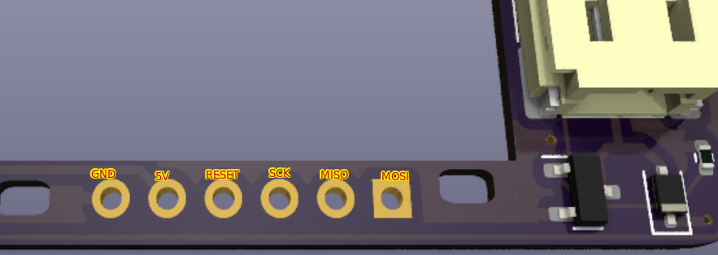

# Programming

This guide is a work in progress.

In order to program the E-Fidget, you'll need the following:

1. A USB-capable Arduino & a cable for it
2. Some jumper wires
3. A soldering iron *or* a lot of patience with finicky unsoldered connections
4. 10-30 minutes

[This guide](https://docs.arduino.cc/built-in-examples/arduino-isp/ArduinoISP#how-to-wire-your-boards) details how to program a generic Arduino with another Arduino. Here is the E-Fidget's pinout, with the motors facing down and the USB port facing away from you:

